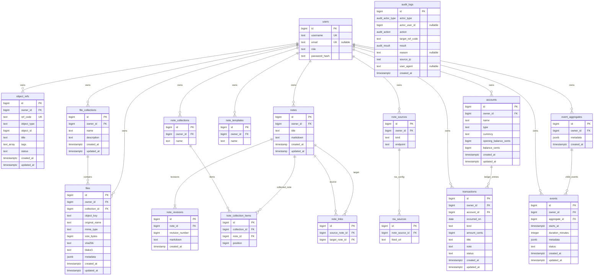
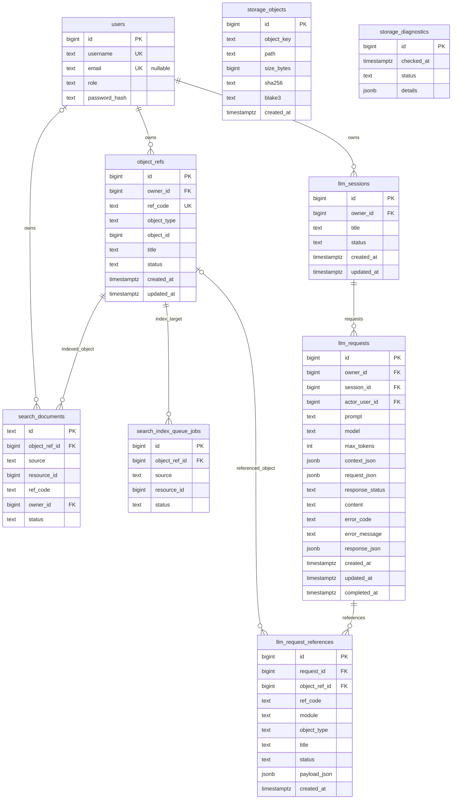

# ER.md

## 1. Goal

This document records the current data model boundaries, data ER diagrams, and key relationship explanations. The specific schema in `migrations` is the authoritative source.

---

## 2. Current Table Groupings

The current baseline contains at least the following table groupings:

```text
identity:
  users

audit:
  audit_logs

platform_ref:
  object_refs

files:
  file_collections
  files

notes:
  notes
  note_revisions
  note_collections
  note_collection_items
  note_links
  note_templates
  note_sources
  rss_sources

accounting:
  accounts
  transactions

calendar:
  event_aggregates
  events

platform_search:
  search_documents
  search_index_queue_jobs

platform_storage:
  storage_objects
  storage_diagnostics

llm:
  llm_sessions
  llm_requests
  llm_request_references
```

Explanation:

```text
Whether the current migrations have created specific tables is subject to migrations.
Migration-created reserved tables that do not have current runtime APIs are intentionally omitted from this runtime model summary.
docs/api/NOTES.md currently fixes the contract to only require an owner-only, single copy of the current Markdown Note API; migrations/000004_notes.sql already provides the markdown and timestamp fields used by this contract; revision and collection-related behavior are future capabilities.
```

---

## 3. Data ER Diagrams

### 3.1 Business Core Data

The diagram below expresses the complete domain target structure, including future capabilities that have not yet entered the current Notes API contract; you cannot infer from this that routes are already available.



Explanation:

| Grouping | Relationship Explanation |
| --- | --- |
| Identity / Audit | `users` is the main source of actors and owners; `users.username` is the unique login identifier, `users.email` can be null; `users.role` distinguishes `superuser` / `user` for permission isolation; `users.password_hash` only stores bcrypt password hashes, not plaintext passwords. JWT is the authentication bearer token, generated after password verification during login; middleware verifies the signature and checks the Redis session before injecting the Principal; the JWT itself is not persisted as a business resource relationship. `audit_logs` use `actor_type`, a nullable historical `actor_user_id`, and a non-nullable `target_ref_code`, but do not associate with users or business objects via foreign keys, ensuring audit evidence is retained even after objects are deleted. `SYS-00000000` only denotes system-level targets like logins and logouts. `READ` is only used for reads initiated by LLMs. The audit table rejects `UPDATE`, `DELETE`, and `TRUNCATE` via database triggers; it can only be inserted into and queried at runtime. |
| ObjectRef | `object_refs` is the globally unified object registry and the authoritative source for `ref_code` and cross-module `title`, `tags`, and current `status` projections. `object_refs.id` is the cross-module universal object ID; `ref_code` is the stable, readable reference code for users, search, and LLMs; `object_type/object_id` map to the source business table. The business source and state transition rules of title/tag/status are still the responsibility of the source business module; business reads must still return to the source module's service / facade. |
| Files | `file_collections` are similar to Accounting ledgers and own multiple immutable `files`. Both Collection and File are registered as `FIL-*` ObjectRefs, using the `file_collection` and `file` object_type respectively. File blobs point to `./objects/{FILE_REFCODE}/blob` in the local FS via `object_key`, and must be verified before downloading using the `sha256` and `blake3` in the metadata. When a Collection is deleted, the service cascades through the unified File delete process one by one and records the cascade reason. |
| Notes | The current API only operates on a single copy of the current source content represented by `notes.markdown`, and uses owner-only access rules; it does not provide endpoints for versioning, recovery, sharing, or collection navigation. `note_revisions`, `note_links`, and `note_collection_items` express future domain capabilities and do not represent what the current API implements. |
| Accounting | `accounts` are ledgers, and `transactions` are directly subordinated immutable entries. Both Account and Transaction are registered as `ACC-*` objects and project their tags to ObjectRef; a Transaction only allows `posted -> voided`, and single entries cannot be deleted. When deleting an Account, transactions are cascade-deleted following ledger deletion semantics, while the service cleans up corresponding object refs in the same transaction. `accounts.balance_cents` is a cache recalculated only from posted entries, and balance-related writes lock the account row first. |
| Calendar | `event_aggregates` are event aggregates and can be created empty; `events` are specific schedule instances that must belong to an aggregate and can only be created via the parent aggregate scope. Both EventAggregate and Event are registered as `CAL-*` ObjectRefs and each project their tags to ObjectRef. Their metadata is immutable after creation; Event only stores `starts_at` and `duration_minutes`, and its status only allows `scheduled -> finished`, `scheduled -> voided`, and `finished -> voided`. The main CalendarView only returns scheduled events; aggregate details return all child events including finished / voided ones. Deletions are only allowed at the EventAggregate level, and the service cascades cleanup of child events and object refs, writing a DELETE audit for each cascade-deleted event. |

---

### 3.2 Platform Capability Data



Explanation:

| Grouping | Relationship Explanation |
| --- | --- |
| Search | `search_documents.object_ref_id` points to the global object; `source/resource_id` retain source object positioning information; search indices store denormalized text and do not replace source tables. |
| ObjectRef | `object_refs` maintains global object IDs, readable reference codes, title/tags/status metadata projections, and mapping to source business objects. Platform metadata queries directly read `object_refs.tags`; cross-module generic relations prioritize referencing `object_refs.id`. |
| Storage | `storage_objects` records committed local FS blob metadata; business tables logically reference local file contents via `object_key`. Files uploads first write staging blobs outside the business transaction, then promote them to final keys with a short local FS rename while final metadata is recorded. |
| LLM | `llm_requests` belong to `llm_sessions`; the same row stores request inputs, authorization contexts, provider request JSON, and response results. Request input fields are immutable once written; `response_status` is created as `queued`, advanced to `running` by a fixed number of LLM workers using PostgreSQL `FOR UPDATE SKIP LOCKED`, and then written once as `success` or `error`. The terminal state `success/error` cannot be rewritten; provider timeouts result in `error_code = llm_request_timeout`; requests cannot be deleted individually, only recursively deleted with the session, writing a request/session DELETE audit. `llm_request_references` stores an ObjectRef snapshot and the authorization payload of the objects referenced by the request; LLM does not own other modules' data. LLM must access business objects via the corresponding module's service / facade, and write an LLM-originated READ audit. |

---

## 4. Modeling Rules

```text
PostgreSQL stores metadata
Local filesystem storage stores file blobs
Redis stores auth session state only
object_refs.status stores the current status projection for registered business objects
object_refs.title stores the cross-module title projection for registered business objects
object_refs.tags stores the cross-module tag projection for registered business objects
status semantics and transitions are owned by source business modules; status does not grant access
owner_id is the default resource ownership field
object_refs.id is the global object id for cross-module relations
ref_code is the human-readable object reference for UI, search, and LLM
object_refs is the authoritative source of ref_code and metadata title/tags/status projections
source business modules own their domain title/tag source rules and synchronize projections in the same business operation
```

Platform search index stores denormalized searchable text and source references. It does not replace source tables.

Business modules save their own core data; platform modules provide generic capabilities; cross-module relationships are preferably resolved via `object_refs`, `object_ref_id`, `ref_code`, and source module services / facades.

---

## 5. Object Ref Code Conceptual Model

Object Ref Code maintains a globally unified object registry at the platform layer, used to map readable reference codes and global object IDs to real business objects.

Current core structure:

```text
platform_ref:
  object_refs
    id
    owner_id
    ref_code
    object_type
    object_id
    title
    tags
    status
    created_at
    updated_at
```

Modeling boundaries:

```text
object_refs is the global object registry
object_refs.id is the cross-module generic object ID
object_refs.ref_code is the readable reference code for users and LLMs, and is the sole authoritative source of ref_code
object_refs.title/tags/status are the display projections for cross-module metadata; tags use TEXT[]
ref_code prefixes identify the module: NTE / FIL / ACC / CAL / LLM
multiple object_types within the same module are distinguished by the object_type field, e.g., Calendar uses event_aggregate and event
object_refs does not replace source business tables
business table relationships can still use internal ids
cross-module generic relationships prioritize using object_ref_id
reading real objects still goes through source module services / facades
specific schemas, indexes, and migrations are subject to implementation migrations
```

Suggested constraints:

```text
object_refs.ref_code unique
object_refs(owner_id, object_type, object_id) unique
object_refs(owner_id, status) indexed
object_ref_code_sequence uniformly generates 8-character uppercase Hex suffixes, numbers are not reused
search_documents(object_ref_id) indexed
```

---

## 6. Unified Tag Conceptual Model

Tags do not belong to a single business module. All referenceable business objects store their current tag projection via `object_refs.tags`.

Candidate structure:

```text
platform_ref:
  object_refs.tags TEXT[]
```

Modeling boundaries:

```text
object_refs.tags stores the object's current list of tags
tags are trimmed, empty values are discarded, and duplicates are removed (keeping first occurrence) when written
Platform metadata reads tags from the object_refs row and returns them alongside ref_code/title/status; tagless objects return an empty array
when creating or updating title/tags/status, the source module service should synchronously project metadata in the same business operation
when deleting a source object, the service should synchronously clean up object_refs
```

Examples:

```text
NTE-00000001 + work
FIL-00000002 + work
CAL-00000003 + work
ACC-00000004 + work
```
