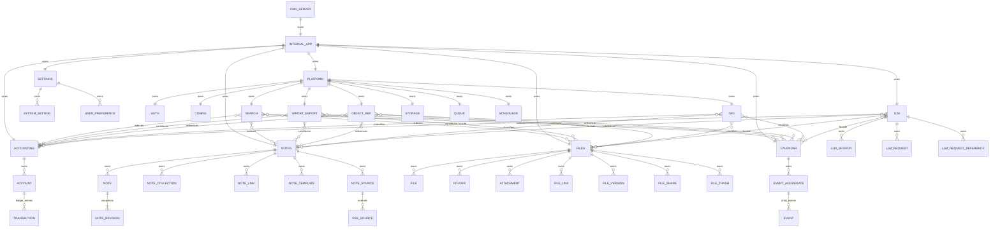
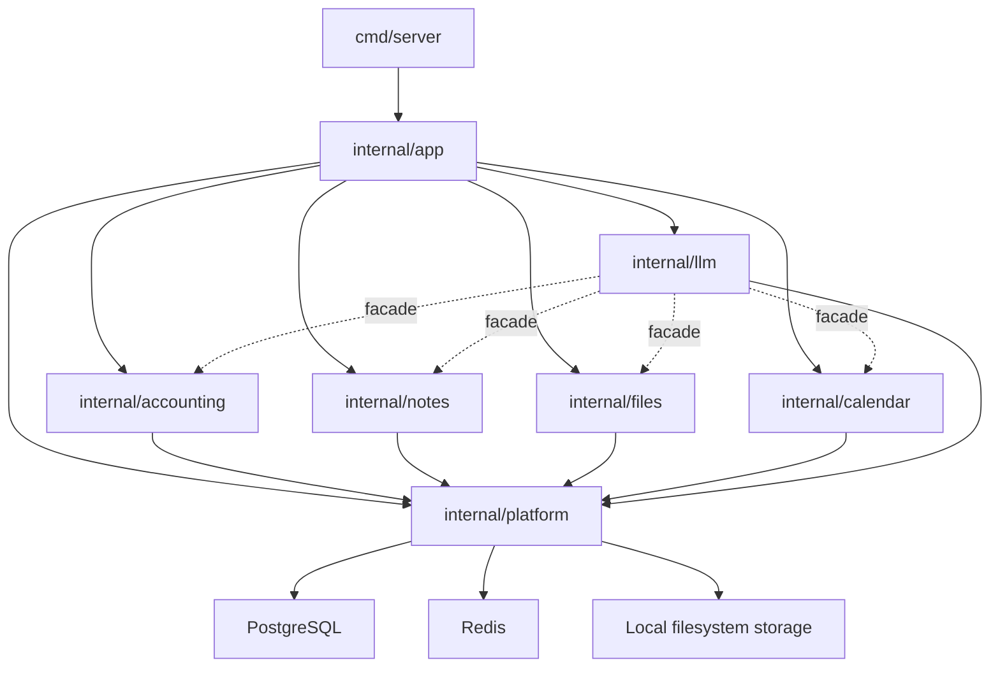

# MODULE_ER.md

## 1. Goal

This document uses diagrams to record Saturn's module relationships, first-class business objects owned by the modules, and the collaboration boundaries between horizontal platform capabilities and business modules.

Module boundaries follow [MODULES.md](MODULES.md) and [FILES.md](FILES.md); database table relationships follow [ER.md](ER.md) and `migrations`.

---

## 2. Module ER Diagram



Explanation:

| Module | Main Responsibility | Owned Data / Objects | Collaboration Boundaries |
| --- | --- | --- | --- |
| `cmd/server` | HTTP server entry point | No business objects | Only starts `internal/app` |
| `internal/app` | Dependency wiring, route registration, middleware | No business objects | Can wire modules and routes, does not carry business rules |
| `internal/accounting` | Minimalist manual accounting and balance statistics | `Account`, `Transaction` | Executes resource-level authorization and auditing via service; title/tags/status project to `ObjectRef` |
| `internal/notes` | Notes, revisions, collections, source sync | `Note`, `NoteRevision`, `NoteCollection`, `NoteLink`, `NoteTemplate`, `NoteSource`, `RSSSource` | Title/tags/status project to `ObjectRef` |
| `internal/files` | Immutable file collections, immutable file metadata, upload/download, deletion | `FileCollection`, `File` | File blobs are written to local FS via `platform/storage`; both Collection and File are registered as `FIL-*`, title/status project to `ObjectRef` |
| `internal/calendar` | Event aggregates, specific schedule events, and main calendar views | `EventAggregate`, `Event` | EventAggregate can be created empty; Event must be created under an aggregate; both are registered as `CAL-*` ObjectRefs, their metadata is immutable after creation, tags are written to `ObjectRef`; Event only allows `scheduled -> finished`, `scheduled -> voided`, `finished -> voided` |
| `internal/llm` | Controlled auxiliary sessions, requests, authorization reference contexts, async provider calls and audits | `LLMSession`, `LLMRequest`, `LLMRequestReference` | Session and Request project to `ObjectRef`; Request saves inputs and results in the same row, is immutable after submission, and can only be advanced `queued -> running -> success/error` by PostgreSQL-backed LLM workers; only allows deleting the entire Session and recursively deleting requests; only orchestrated via business services / facades, does not directly access business repos |
| `internal/platform` | Horizontal support capabilities | Auth, Audit, Config, ObjectRef metadata search, Storage, Redis sessions, HTTP helpers | ObjectRef aggregates `ref_code`, `title`, `tags`, `status` metadata, but does not own vertical business rules |

---

## 3. Dependency Direction Diagram



Dependency Rules:

```text
cmd/server -> internal/app -> business modules -> internal/platform -> external infrastructure
```

This dependency graph must remain a directed acyclic graph (DAG). Dependencies can only flow from upper layers to lower layers, and lower modules cannot directly or indirectly depend on upper modules; no contributor, service, or facade collaboration can form circular dependencies.

`internal/app` can do module wiring, but cannot implement business rules. Business modules can depend on the encapsulation capabilities of `internal/platform`, but cannot directly depend on the Redis client, local FS storage implementations, LLM SDKs, or specific external service clients.

Dashed lines indicate collaboration protocols, not that the platform reversely owns business modules. `platform/objectref` and `llm` must access business capabilities through services or facades, and cannot bypass the authorization, auditing, and security checks of the business modules.
